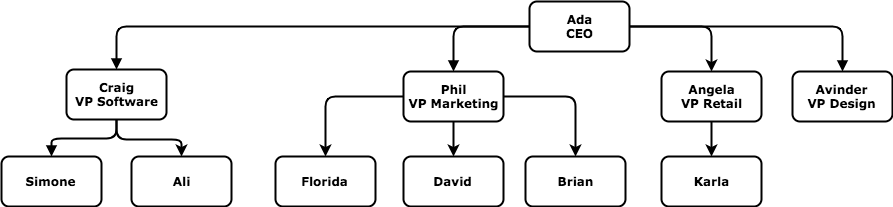

# Introduction to Trees

Congratulations! You've just been hired by a huge, famous and highly successful tech company that thinks differently and is aptly named after a fruit. You guessed it, Durian! You're thrilled to learn that despite popular rumours, their offices do not actually smell like Durian.

Anyway, Durian has specifically hired you to create an app that manages all of the employees in their company.

🤗

This app will contain data about all of the employees at Durian and will need to be able to quickly tell someone the following things about each employee:

  * Who an employee's boss is.
  * The total number of people that an employee supervises.
  * How many people there are between an employee and the CEO.
  * Do two employees share the same boss.
  * Your supervisor hands you a list of all the employee's names, something that looks like this:

## Column Table
Let's start by choosing an employee from the list at random, "Phil", and try to determine the data for the first feature. Who is Phil's boss?

🤔

Given just this list of information, it's difficult to find out who Phil's boss is. There's really no obvious way to determine his boss. So you tell your supervisor that you're having trouble with this information. Your supervisor goes away for a couple of minutes and when she returns, she gives you a table of all the employees.

You the columned table you can determine that Phil's boss is Ada.

## Tree Structure 
Next feature, how many people does Phil supervise? We could count every time "Phil" appears on the right hand column of the columned table. This could take a long time if there were hundreds of employees.

Instead it would be easier to check by using a tree structure to model the data:

Phil's boss is Ada and without having to look at everyone we can tell that Phil supervises 3 people. Great!

For our final feature request, we can also use this diagram to quickly tell that there is one person between Phil and the CEO, and that's Phil. Well, that was easy!

🤗

This is a nice little data structure known as a Tree.

## Representations of Tree Data Structure

## Tree Data Structure - Charts & Definitions

Definitions:

  * node: each circle on a tree diagram represents a key entity and contains data about that entity.

  * edges: the connections between the nodes.

  * root node: the node at the very top of the tree.

  * leaf node(s): the nodes at the very bottom

  * parent node: the parent (above) of the node(s) below it (child nodes).

  * child node(s): the child (below) of the parent node.

  * sibling node(s): child nodes related to each other (same parent node).