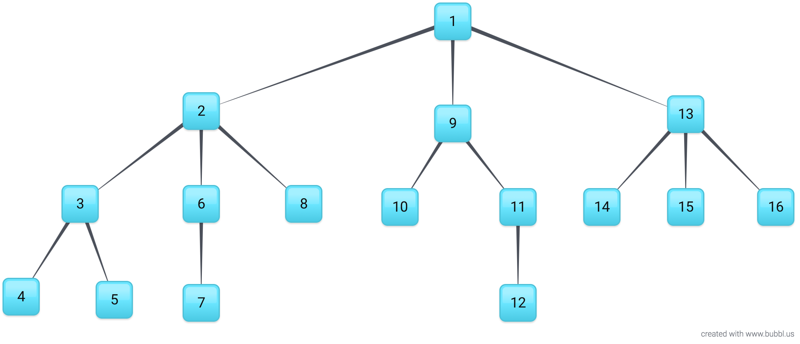
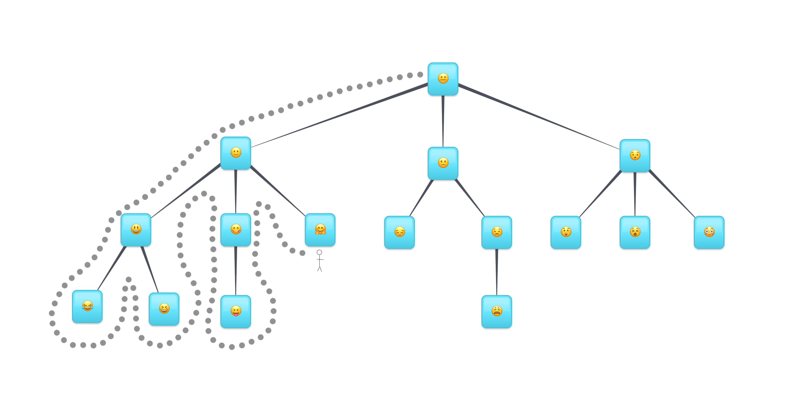
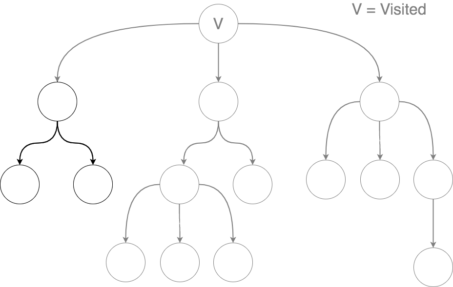

# Tree Traversal: Org Charts! - Reading

## Learning Outcomes 

  * can explain what tree traversal is
  * can explain the difference between breadth first and depth first search
  * can use depth first search to search for an object in a tree

# Goal
Trees are a powerful data structure that we can use when our data has some sort of hierachical structure. 

  * We know how to create trees and how to performm some simple tasks susing a tree. 

  * We know how to do things like determine the number of children a node has or the number of edges between a node and the root node. But this is only scratching the surface of what we can do with trees.

## Traversing the Tree
Very common tasks involve traversing a tree. Traversing through a tree's nodes is similar to looping through items in an array, it's how we can visit every node in a tree. We can go through the entire tree and visit every node or just each node underneath another specific node.

How would you traverse through each node in the tree? Starting from the root.

## Breadth First Traversal
Breadth first traversal will check the nodes closest to the root node, before checking the nodes that are farther away. A breadth first traversal would visit the nodes in this order:

Breadth first traversal:

  * Start with the root node.
  * Then move onto the root's children.
  * Then move onto those node's children.

You'll have noticed that we access each node row-by-row. Breadth first traversal will always visit the nodes closest to the root node before moving on to the nodes that are farther away.

## Depth First Traversal
Depth first traversal will accomplish the same task as breadth first traversal, but we will always be trying to visit the leaf nodes. Depth first traversal will visit each node on an entire path, all the way out to a leaf node, before visiting nodes on the next path. A depth first traversal would visit the nodes in this order:

For depth first traversal, we can imagine that there's a little stick man visiting each node for us. He's going to walk around the tree and check each node one by one. He will only walk around the tree, never crossing over any nodes or edges.

## Sub Trees
A tree is a recursive data structure. A tree is actually made up of smaller sub treets, which themselves are made up of even smaller sub trees.

Every node in the tree, apart fromt he root node, is actually the root node of a smaller tree.

## Traversal
For depth first traversal, we're going to take advantage of the recursive nature of the tree and write a recursive algorithm.

Traverse tree:

  1. Visit the root node of the tree.
  2. Get the first unvisited child sub-tree of the current node.
  3. Do step 1 with the sub-tree.

Here's what the pseudo code might look like:

  traverse tree: 
    visit the root node of the tree.
    let subTree = the first unvisited child sub-tree of the root node.

  Recursive Case:
    If there's a subTree, traverse subTree.

  Base Case:
    If there's no subTree, do nothing

## Code
Here's what the implementation of this algorithm looks like:

    class Node {

      constructor(data) {
        this.data = data;
        this.parent = null;
        this.children = [];
      }

      depthFirstTraversal() {

        console.log(this); // 1

        for (const childNode of this.children) {
          childNode.depthFirstTraversal(); // 2
        }
      }
    }

1. Visit the current node. In this case, we're just printing out the data.
2. Loop through every child of the current node and repeat the first step with that node.