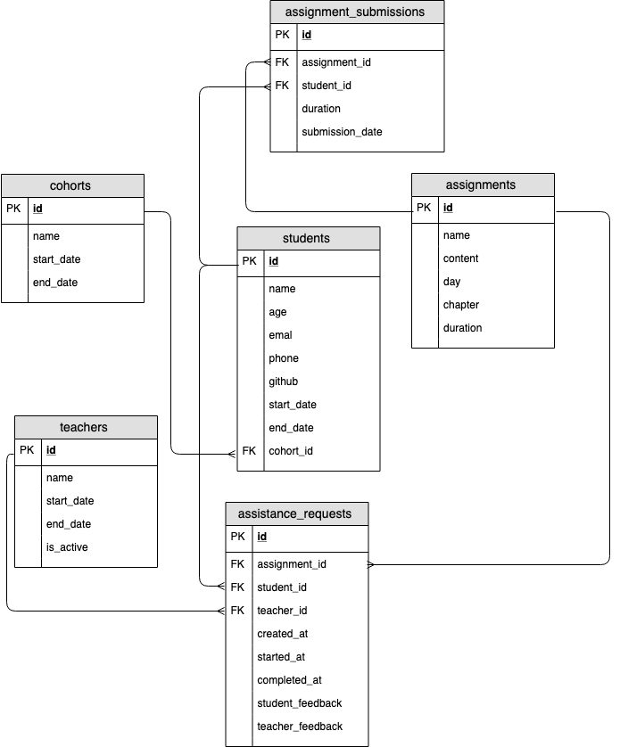

# Creating ERDs 

## Entity Relationship Diagrams (ERDs)
An Entity Relationship Diagram helps us design the schema of a database. We can use pen/paper, a whiteboard or an online tool like draw.io.

The key is to iterate on the design BEFORE committing it to the database. This is a situation where we ALWAYS save time by planning.

  * Always design a database using an ERD before writing any code.

## Bootcamp ERD
Here is a familiar looking example of an ERD for a Bootcamp:

## Key Info that Must be Present in an ERD

  * Names of Entities
  * Attributes / properties for the Entities
  * The relations between each entity

There are multiple options for symbols to draw in order to identify the relationship time.

Here we are using a crows foot: 

For now we can view each entity as a table, which is generally true but not always the case for more complicated ERDs.

## Naming Convention
We use naming conventions to increase constistency which provides us with some level of predictability. We can write queries faster if we don't have to look up column names constantly.

  * Use snake_case for table and column names.
  * Pluralize tables names, column names should be singular.
  * Call your primary key `id`.
  * For most foreign keys use the <table>_id

## Conclusion
This reading covers the basics of creating an ERD. Keep this open as a reference when creating ERds in the future.